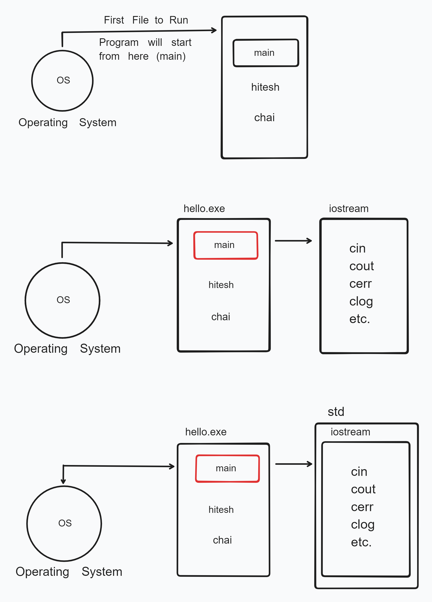

# Going Depth of Hello World 🚀❤️‍🔥

```cpp
#include <iostream>

using std::cout;
using std::endl;

int main(){
    cout << "Hello Chai with Chinmay Kaitade" << endl;
    return 0;
}
```



1. All lines, that are starting from "#" they are called as Pre-Processors Directives.
   ex. #include, #region, #endregion, etc.

2. "#" -> Pre-Processors Directives

3. <iostream> -> cin, cout, cerr, clog, etc.

- This will control the Input/Outout of stream. (It will takes Input/Output from various Source)

4. Using namespace std;

### Another Method

```cpp
#include <iostream>

using std::cout;
using std::endl;

int main(){
    cout << "Hello Chai with Chinmay Kaitade" << endl;
    return 0;
}
```

### Summary

1. Anything that is Starting with "#" is a Pre-Processor Directives.
2. In our case, it is inclusive.
3. Every C++ file has `main` method from where the program should start. Return type of this should be defined its compulsory.
