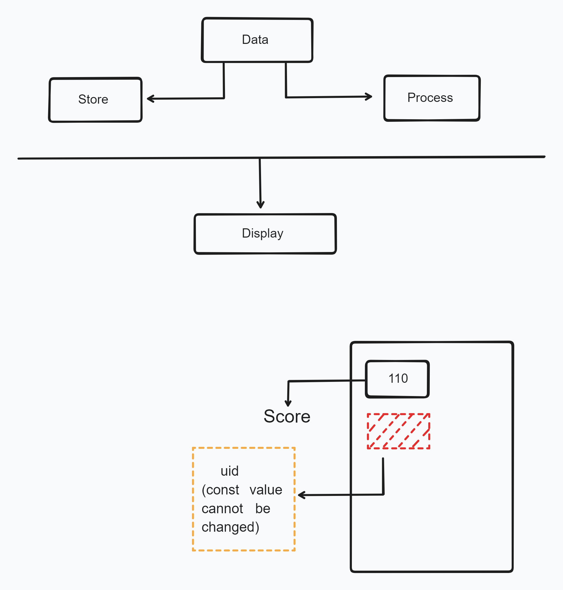

# Variable and Constants 🚀❤️‍🔥

`main.cpp`

```cpp
#include <iostream>

using namespace std;

int main(){
    cout << "Hello Chai with CPP" << endl;
    return 0;
}
```

### Comments in C++

```cpp
#include <iostream>

using namespace std;

int main(){
    // cout << "Hello Chai with CPP1" << endl; --> single line comment

    /*
    cout << "Hello Chai with CPP2" << endl;

    cout << "Hello Chai with CPP3" << endl;
    return 0;
    */ // --> Multi-line comment
}
```

