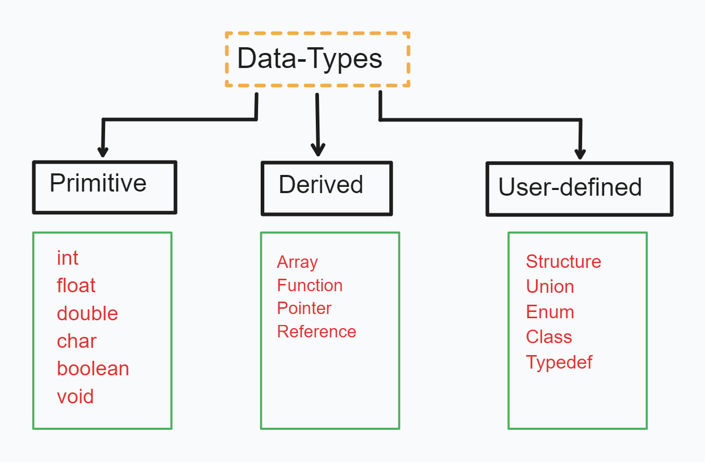

# Data Types and Challenges 🚀❤️‍🔥



### Data Types

```cpp
#include <iostream>

using namespace std;

int main(){

    int teaLeaves = 50;
    float waterTemperature = 85.5;
    // float waterTemperature = 85.59999; --> 85.6
    double priceOfTea = 299.99;
    // double priceOfTea = 299.99999999999; --> 300
    char teaGrade = 'A';
    // char teaGrade = 'ABC'; --> C (always prints last value)
    bool isTeaReady = false;

    cout << isTeaReady << endl; // false - 0, true - 1

    return 0;
}
```

### Modifiers

```cpp
#include <iostream>

using namespace std;

int main(){

    unsigned smallTeaPack = 100; // 100
    // unsigned smallTeaPack = -100; --> It will not throw error but it will give garbage value
    // int smallTeaPack = -100; --> -100

    long largeTeaStorage = 10000000; // 10000000
    // double largeTeaStorage = 10000000; --> 1e+07
    // float largeTeaStorage = 10000000; --> 1e+07
    // long long largeTeaStorage = 100000000000000000; --> 100000000000000000

    short teaSample = 25; // 25


    cout << teaSample << endl;

    return 0;
}

// unsigned --> User will not take sign elements (that is user will not enter any sign value.ex. -ve value, -100, etc. )
```

### Casting

```cpp
#include <iostream>

using namespace std;

int main(){

    float teaPrice = 49.99;
    int roundedTeaPrice = (int) teaPrice; // 49
    // int roundedTeaPrice = (short) teaPrice; --> 49

    int teaQuantity = 2;
    // int totalPrice = teaPrice * teaQuantity; --> 99
    double totalPrice = teaPrice * teaQuantity; // 99.98

    cout << totalPrice << endl;

    return 0;
}
```

### Strings

```cpp
#include <iostream>
#include <string>

using namespace std;

int main(){
    string favoriteTea = "Lemon Tea \n"; // Lemon Tea
    string description = "Known as \"Best\" Tea";
    // Lemon
    // TeaKnown as "Best" Tea

    cout << favoriteTea << description << endl;

    return 0;
}

// \n --> New line
// \t --> Tab
```

### Taking User Input

```cpp
#include <iostream>
#include <string>

using namespace std;

int main(){
    string userTea;
    string teaQuantity;

    cout << "What would you like to order in Tea? \n" << endl;
    getline(cin, userTea);

    // asking user from quantity
    cout << "How many cups of " << userTea << "would you like to have? \n" << endl;
    cin >> teaQuantity;

    cout << teaQuantity;
    cout << userTea;

    return 0;
}
```
