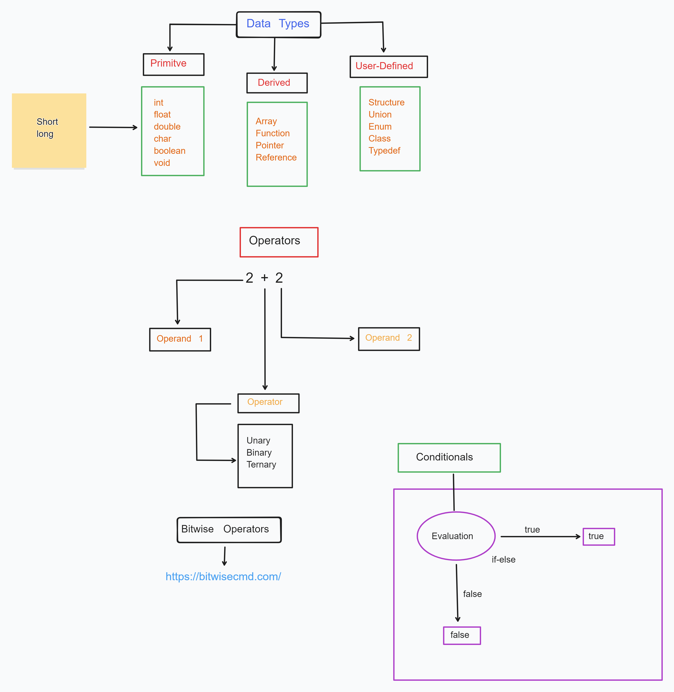
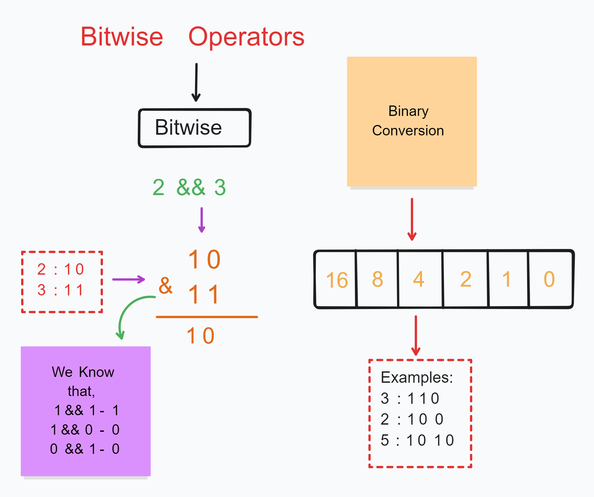

# Operators in C++ 🚀❤️‍🔥



### 1. **Arithmetic Operators**

**Challenge:** Create a program that calculates the total price of tea cups. The user inputs the number of cups they want and the price per cup. The program should calculate the total price, apply a 5% discount if the total is above a certain amount, and show the final price.

> +, -, \*, /, %

### 2. **Assignment Operators**

**Challenge:** Write a program that allows a user to input the number of tea bags they have. Assign additional bags to them based on certain conditions (e.g., if they have fewer than 10 bags, give them 5 extra). Update the original number using assignment operators.

> +=, -=, \*=, /=, %=

### 3. **Relational Operators**

**Challenge:** A tea shop offers a loyalty program. Customers who buy more than 20 cups of tea get a special "Gold" badge, and those who buy 10 to 20 cups get a "Silver" badge. Write a program to display the badge they will receive based on the number of cups they buy.

> > , >=, <, <=

### 4. **Logical Operators**

**Challenge:** Create a program that checks if a user is eligible for a tea subscription discount. The discount applies if the user is either a student or has purchased more than 15 cups. Ask the user to input their status (student or not) and their cup count.

> > && and || operators

### 5. **Bitwise Operators**



### Online resources [READ THIS DOCS](https://bitwisecmd.com/)

### **Explanation of the Code (Bitwise AND for Tea Stock Check)**

```cpp
#include <iostream>
using namespace std;

int main() {
    int stock = 5; // Binary: 101 (Green and Oolong in stock)

    cout << "Tea Types:\n1 - Green Tea\n2 - Black Tea\n4 - Oolong Tea\n";
    cout << "Enter the tea type you want to check (1, 2, or 4): ";

    int choice;
    cin >> choice;

    if (choice == 1 || choice == 2 || choice == 4) {
        if (stock & choice) {
            cout << "The selected tea is in stock.\n";
        } else {
            cout << "The selected tea is NOT in stock.\n";
        }
    } else {
        cout << "Invalid input! Please enter 1, 2, or 4.\n";
    }

    return 0;
}
```

The program checks the availability of different types of tea using **bitwise AND (`&`)**. Here's a step-by-step breakdown of the logic:

---

### **1️⃣ Understanding Tea Stock Encoding**

We store the tea stock as an **integer**, where each tea type is represented by a unique power of 2:

| Tea Type   | Binary Value | Decimal Value |
| ---------- | ------------ | ------------- |
| Green Tea  | `0001`       | `1`           |
| Black Tea  | `0010`       | `2`           |
| Oolong Tea | `0100`       | `4`           |

Each tea type is assigned a **bit position**. If a bit is `1`, it means the tea is **available**; if `0`, it's **out of stock**.

---

### **2️⃣ Storing Available Teas in an Integer**

We use an **integer** (`stock`) to encode the availability of multiple teas. Let's assume:

```cpp
int stock = 5; // Binary: 101
```

#### **Binary Breakdown of `stock = 5` (101 in binary)**

- **1st bit (rightmost, 2⁰)** → Green Tea (`1`) → **Available**
- **2nd bit (2¹)** → Black Tea (`2`) → **NOT Available**
- **3rd bit (2²)** → Oolong Tea (`4`) → **Available**

---

### **3️⃣ Taking User Input**

The program asks the user to enter a tea type to check availability:

```cpp
cout << "Enter the tea type you want to check (1, 2, or 4): ";
cin >> choice;
```

The user inputs either `1` (Green Tea), `2` (Black Tea), or `4` (Oolong Tea).

---

### **4️⃣ Checking Tea Availability Using Bitwise AND (`&`)**

The key logic of the program is:

```cpp
if (stock & choice) {
    cout << "The selected tea is in stock.\n";
} else {
    cout << "The selected tea is NOT in stock.\n";
}
```

The **bitwise AND (`&`)** operator is used to check whether the requested tea type is in stock.

#### **How Bitwise AND Works?**

Bitwise AND compares the binary representation of `stock` and `choice`, **bit by bit**. If a bit is `1` in both numbers, the result is `1`; otherwise, it's `0`.

##### **Example 1: User selects Green Tea (`1`)**

- `stock = 5 (101 in binary)`
- `choice = 1 (001 in binary)`
- **Bitwise AND:**
  ```
    101 (stock)
  & 001 (choice)
  ------------
    001 (result = 1 → Green Tea is available)
  ```
  ✅ **Output: "The selected tea is in stock."**

##### **Example 2: User selects Black Tea (`2`)**

- `stock = 5 (101 in binary)`
- `choice = 2 (010 in binary)`
- **Bitwise AND:**
  ```
    101 (stock)
  & 010 (choice)
  ------------
    000 (result = 0 → Black Tea is NOT available)
  ```
  ❌ **Output: "The selected tea is NOT in stock."**

##### **Example 3: User selects Oolong Tea (`4`)**

- `stock = 5 (101 in binary)`
- `choice = 4 (100 in binary)`
- **Bitwise AND:**
  ```
    101 (stock)
  & 100 (choice)
  ------------
    100 (result = 4 → Oolong Tea is available)
  ```
  ✅ **Output: "The selected tea is in stock."**

---

### **5️⃣ Handling Invalid Inputs**

The program checks if the user enters a valid tea type (`1`, `2`, or `4`):

```cpp
if (choice == 1 || choice == 2 || choice == 4) {
```

If the user enters something else (e.g., `3`, `5`), the program prints:

```
Invalid input! Please enter 1, 2, or 4.
```

---

### **🔹 Key Takeaways**

✅ **Bitwise AND (`&`)** is a great way to check flags (binary state tracking).  
✅ **Stock is stored as a single integer**, making it memory-efficient.  
✅ **Each tea type is represented using bits**, making checking availability fast.
